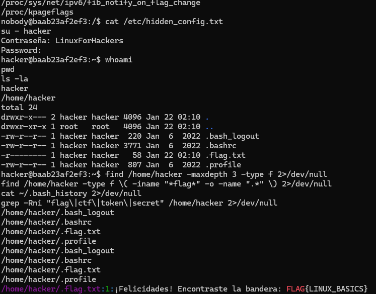
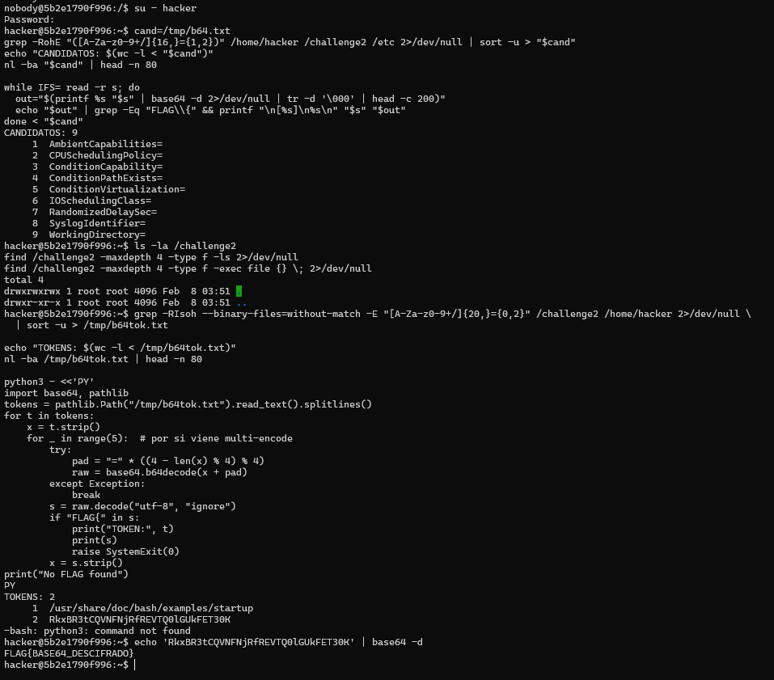

## Desafío 1: Logs y Configuración

### Objetivo
Encontrar flags ocultas en archivos del sistema, logs y configuraciones dentro del contenedor `challenge1_ctf`.

### Proceso realizado
1. Se enumeraron usuarios con `cat /etc/passwd` y se identificó `hacker` como usuario con shell (`/bin/bash`).
2. Se exploraron rutas principales (`/`, `/home`, `/etc`, `/var/log`) y se hicieron búsquedas por palabras clave (`flag`, `ctf`, `token`, `secret`).
3. Se encontró una credencial en `/etc/hidden_config.txt`:
   - `Contraseña: LinuxForHackers`
4. Se cambió a `hacker` con `su - hacker` usando esa contraseña.
5. En `/home/hacker` se localizaron archivos ocultos y se detectó `.flag.txt`.
6. Se extrajo la bandera desde `/home/hacker/.flag.txt`.

### Resultado
Flag encontrada:

`FLAG{LINUX_BASICS}`

### Evidencia
- Credencial: `/etc/hidden_config.txt`
- Bandera: `/home/hacker/.flag.txt`

### Imagen


## Desafío 2: Codificación Base64

### Objetivo
Identificar y decodificar cadenas Base64 para revelar una flag.

### Proceso realizado
1. Se ingresó al contenedor `challenge2_ctf` y se observó el mensaje indicando usar la flag del Desafío 1 para iniciar sesión como `hacker`.
2. Se cambió de usuario con `su - hacker` usando como contraseña `FLAG{LINUX_BASICS}`.
3. Se realizó la búsqueda de candidatos Base64 en las carpetas:
   - `/challenge2` y `/home/hacker`

```bash
# Extraer tokens con caracteres típicos de Base64 y longitud mínima
grep -RIsoh --binary-files=without-match -E "[A-Za-z0-9+/]{20,}={0,2}" /challenge2 /home/hacker 2>/dev/null \
  | sort -u > /tmp/b64tok.txt
nl -ba /tmp/b64tok.txt
```

4. De los resultados, se identificó el candidato:
   - `RkxBR3tCQVNFNjRfREVTQ0lGUkFET30K`
5. Se decodificó con `echo 'RkxBR3tCQVNFNjRfREVTQ0lGUkFET30K' | base64 -d`.

### Resultado
Flag encontrada:

`FLAG{BASE64_DESCIFRADO}`

### Evidencia
- Cadena Base64: `RkxBR3tCQVNFNjRfREVTQ0lGUkFET30K`
- Decodificación: `echo 'RkxBR3tCQVNFNjRfREVTQ0lGUkFET30K' | base64 -d`

### Imagen
