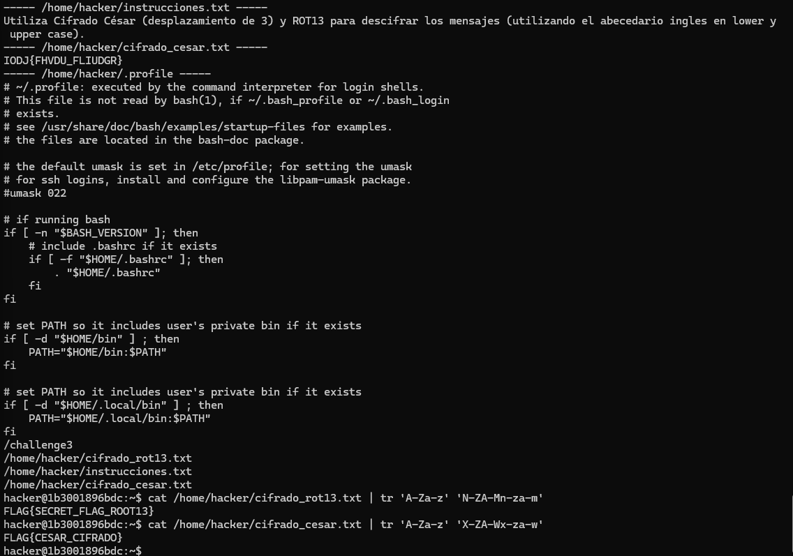
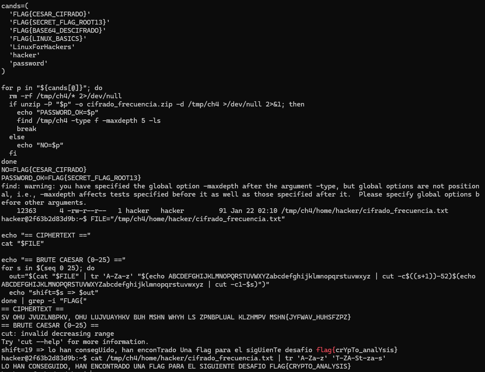

## Desafío 1: Logs y Configuración

### Objetivo
Encontrar flags ocultas en archivos del sistema, logs y configuraciones dentro del contenedor `challenge1_ctf`.

### Proceso realizado
1. Se enumeraron usuarios con `cat /etc/passwd` y se identificó `hacker` como usuario con shell (`/bin/bash`).
2. Se exploraron rutas principales (`/`, `/home`, `/etc`, `/var/log`) y se hicieron búsquedas por palabras clave (`flag`, `ctf`, `token`, `secret`).
3. Se encontró una credencial en `/etc/hidden_config.txt`:
   - `Contraseña: LinuxForHackers`
4. Se cambió a `hacker` con `su - hacker` usando esa contraseña.
5. En `/home/hacker` se localizó `.flag.txt`.
6. Se extrajo la bandera desde `/home/hacker/.flag.txt`.

### Resultado
Flag encontrada:

`FLAG{LINUX_BASICS}`

### Evidencia
- Credencial: `/etc/hidden_config.txt`
- Bandera: `/home/hacker/.flag.txt`


## Desafío 2: Codificación Base64

### Objetivo
Identificar y decodificar cadenas Base64 para revelar una flag.

### Proceso realizado
1. Se ingresó al contenedor `challenge2_ctf` y se observó el mensaje indicando usar la flag del Desafío 1 para iniciar sesión como `hacker`.
2. Se cambió de usuario con `su - hacker` usando como contraseña `FLAG{LINUX_BASICS}`.
3. Se realizó la búsqueda de candidatos Base64 en las carpetas:
   - `/challenge2` y `/home/hacker`

```bash
# Extraer tokens con caracteres típicos de Base64 y longitud mínima
grep -RIsoh --binary-files=without-match -E "[A-Za-z0-9+/]{20,}={0,2}" /challenge2 /home/hacker 2>/dev/null \
  | sort -u > /tmp/b64tok.txt
nl -ba /tmp/b64tok.txt
```

4. De los resultados, se identificó el candidato:
   - `RkxBR3tCQVNFNjRfREVTQ0lGUkFET30K`
5. Se decodificó con:

```bash
echo 'RkxBR3tCQVNFNjRfREVTQ0lGUkFET30K' | base64 -d
```

### Resultado
Flag encontrada:

`FLAG{BASE64_DESCIFRADO}`

### Evidencia
- Cadena Base64: `RkxBR3tCQVNFNjRfREVTQ0lGUkFET30K`
- Decodificación: `echo 'RkxBR3tCQVNFNjRfREVTQ0lGUkFET30K' | base64 -d`


## Desafío 3: Cifrado César y ROT13

### Objetivo
Descifrar mensajes usando ROT13 y Cifrado César (desplazamiento 3) para encontrar flags.

### Proceso realizado
1. Se inició sesión como `hacker` usando la flag del Desafío 2 como contraseña: `FLAG{BASE64_DESCIFRADO}`.
2. Se revisaron los archivos del reto en `/home/hacker`:
   - `/home/hacker/cifrado_rot13.txt`
   - `/home/hacker/cifrado_cesar.txt`
   - `/home/hacker/instrucciones.txt` (indica ROT13 y César shift 3).
3. Se descifró ROT13 con `tr`:

```bash
cat /home/hacker/cifrado_rot13.txt | tr 'A-Za-z' 'N-ZA-Mn-za-m'
```

4. Se descifró César con desplazamiento 3 (corrimiento hacia atrás) con `tr`:

```bash
cat /home/hacker/cifrado_cesar.txt | tr 'A-Za-z' 'X-ZA-Wx-za-w'
```

### Resultado
Flags encontradas:

`FLAG{SECRET_FLAG_ROOT13}`

`FLAG{CESAR_CIFRADO}`

### Evidencia
- ROT13: `/home/hacker/cifrado_rot13.txt`
- César: `/home/hacker/cifrado_cesar.txt`
- Instrucciones: `/home/hacker/instrucciones.txt`

### Imagen


## Desafío 4: Análisis de Frecuencia (César)

### Objetivo
Descifrar un mensaje usando análisis de frecuencia para encontrar una flag.

### Proceso realizado
1. Se ingresó al contenedor `challenge4_ctf` y se identificó un archivo protegido:
   - `/home/hacker/cifrado_frecuencia.zip`
2. Se listó el contenido del zip y se detectó que requería contraseña:

```bash
unzip -l /home/hacker/cifrado_frecuencia.zip
```

3. Se probó con contraseñas probables (flags anteriores) y funcionó:
   - Contraseña del zip: `FLAG{SECRET_FLAG_ROOT13}`
4. Se extrajo el archivo del zip:

```bash
unzip -P 'FLAG{SECRET_FLAG_ROOT13}' -o /home/hacker/cifrado_frecuencia.zip -d /tmp/ch4
```

5. Se obtuvo el texto cifrado desde:
   - `/tmp/ch4/home/hacker/cifrado_frecuencia.txt`
6. Se aplicó César y se encontró el desplazamiento correcto (shift 19). Para descifrar:

```bash
cat /tmp/ch4/home/hacker/cifrado_frecuencia.txt | tr 'A-Za-z' 'T-ZA-St-za-s'
```

### Resultado
Flag encontrada:

`FLAG{CRYPTO_ANALYSIS}`

### Evidencia
- Zip: `/home/hacker/cifrado_frecuencia.zip`
- Password del zip: `FLAG{SECRET_FLAG_ROOT13}`
- Archivo extraído: `/tmp/ch4/home/hacker/cifrado_frecuencia.txt`

### Imagen
   

### Analisis y Conclusiones

En los primeros desafíos, la efectividad dependió de una buena enumeración del sistema (usuarios, permisos, logs y archivos ocultos), lo que confirmó que muchos secretos no están “cifrados”, sino mal ubicados o expuestos por configuración. En Base64, quedó claro que no es cifrado sino codificación, identificar correctamente candidatos y reducir falsos positivos fue más importante que la decodificación en sí.

En César/ROT13, la lección principal fue aplicar primero hipótesis simples y verificables (ROT13 directo, desplazamiento clásico) antes de métodos complejos. En análisis de frecuencia, se vio que la estadística orienta el ataque, pero normalmente se combina con validación manual y pruebas iterativas (por ejemplo, probar shifts hasta encontrar texto coherente/flag). En conjunto, las técnicas fueron efectivas, enumerar, filtrar ruido, probar hipótesis pequeñas y validar resultados.