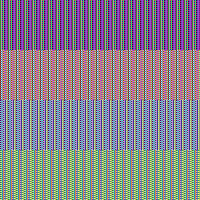

# Análisis de Seguridad - Block Ciphers

## Análisis de Tamaños de Clave

**Pregunta:** ¿Qué tamaño de clave está usando para DES, 3DES y AES? Para cada uno:

- Indique el tamaño en bits y bytes
- Explique por qué DES se considera inseguro hoy en día
- Calcule cuánto tiempo tomaría un ataque de fuerza bruta con hardware moderno

### Tamaños de clave usados en cada algoritmo

- **DES:** 8 bytes = 64 bits

```powershell
python -c "from utils.block.base import generate_des_key; k=generate_des_key(); print(f'DES: {len(k)} bytes = {len(k)*8} bits')"
```

```text
DES: 8 bytes = 64 bits
```

- **3DES (por defecto):** 24 bytes = 192 bits

```powershell
python -c "from utils.block.base import generate_3des_key; k=generate_3des_key(); print(f'3DES: {len(k)} bytes = {len(k)*8} bits')"
```

```text
3DES: 24 bytes = 192 bits
```

- **AES (por defecto, AES-256):** 32 bytes = 256 bits

```powershell
python -c "from utils.block.base import generate_aes_key; k=generate_aes_key(); print(f'AES: {len(k)} bytes = {len(k)*8} bits')"
```

```text
AES: 32 bytes = 256 bits
```
Riesgo de DES:
- **Clave efectiva pequeña:** aunque se manejen **8 bytes (64 bits)**, DES tiene **56 bits efectivos** de clave (hay bits de paridad). Eso reduce el espacio de busqueda a `2^56`, que hoy es alcanzable por fuerza bruta.
- **Bloque de 64 bits:** al cifrar muchos datos con la misma clave, el bloque pequeno facilita colisiones (cumpleanos) y patrones estadisticos.
- **Legado:** en la practica moderna se usa **AES**; **3DES** es principalmente compatibilidad/legado, no recomendado para disenos nuevos.

**Calcule cuanto tiempo tomaria un ataque de fuerza bruta con hardware moderno (estimacion)**

Si una maquina prueba `R` claves/segundo, el tiempo promedio de busqueda exhaustiva es:

`tiempo_promedio ~= 2^(k-1) / R`  (peor caso: `2^k / R`)

- **DES (k = 56 bits efectivos):**
  - Si `R = 10^12` claves/s: peor caso `2^56 / 10^12` ~= **20 horas** (promedio ~= **10 horas**)
  - Si `R = 10^15` claves/s: peor caso `2^56 / 10^15` ~= **72 segundos** (promedio ~= **36 segundos**)
- **3DES (24 bytes en este repo)** y **AES-256 (32 bytes en este repo):** por fuerza bruta directa son muchisimo mas costosos que DES; en la practica, los riesgos reales suelen venir de modo de operacion, IV, padding, implementacion o mal manejo de llaves, no de enumerar todas las claves.

**Ejecución (programa)**

```powershell
python -m utils.block.analysis_report --only keys
```

```text
== Tamaños de clave (este repo) ==
DES:  8 bytes = 64 bits
3DES: 24 bytes = 192 bits (por defecto)
AES:  32 bytes = 256 bits (por defecto, AES-256)

== Fuerza bruta (estimación para DES) ==
Nota: DES usa 56 bits efectivos de clave (los otros bits son de paridad).
R=1e+12 claves/s -> peor=20.0 h, promedio=10.0 h
R=1e+15 claves/s -> peor=72.1 s, promedio=36.0 s
```

---

## Comparación de Modos de Operación
**¿Qué modo de operación implementó en cada algoritmo?**

- **DES:** ECB (ver `utils/block/des_ecb.py`)
- **3DES:** CBC (ver `utils/block/triple_des_cbc.py`)
- **AES (para el experimento de imagen):** ECB y CBC (ver `utils/block/aes_ecb_cbc.py`)

- **ECB:** cifra cada bloque de forma independiente. Bloques iguales de texto plano → bloques iguales de ciphertext (filtra patrones).
- **CBC:** usa un **IV** y encadena bloques (XOR con el ciphertext anterior). Bloques iguales en el texto plano no producen bloques iguales en el ciphertext.

### Ejecución (imágenes + métricas)

```powershell
python -m utils.block.analysis_report --only image --out-dir utils/block/img
```

```text
== ECB vs CBC en imagen (AES-256) ==
Saved: utils/block/img\\original.bmp
Saved: utils/block/img\\ecb_encrypted.bmp
Saved: utils/block/img\\cbc_encrypted.bmp
ECB unique blocks: 6 / 7500 (0.1% unique)
CBC unique blocks: 7500 / 7500 (100.0% unique)
```

| Original | AES-ECB | AES-CBC |
| --- | --- | --- |
|  |  |  |

Código usado: `utils/block/analysis_report.py` (sección `image`) + `utils/block/aes_ecb_cbc.py`.

**Patrones visibles**

- En **ECB** se aprecian las franjas/bloques del patrón original (muchos bloques cifrados repetidos).
- En **CBC** el patrón desaparece (casi todos los bloques cifrados son diferentes).

---

## Vulnerabilidad de ECB
ECB **no debe usarse** en datos sensibles porque filtra estructura: si ciertos bloques cifrados se repiten, el atacante puede inferir repeticiones/patrones del texto plano (campos idénticos, regiones uniformes en imágenes, encabezados repetidos, etc.).

### Ejecución (bloques repetidos en hex)

```powershell
python -m utils.block.analysis_report --only ecb
```

```text
== Vulnerabilidad de ECB (demo con AES) ==
plaintext (repr): b'ATAQUE ATAQUE 12ATAQUE ATAQUE 12ATAQUE ATAQUE 12ATAQUE ATAQUE 12'
plaintext length: 64 bytes
ECB first blocks (hex):
  C[0]: 12eeac294cf1d4e19713492b8bf11679
  C[1]: 12eeac294cf1d4e19713492b8bf11679
  C[2]: 12eeac294cf1d4e19713492b8bf11679
  C[3]: 12eeac294cf1d4e19713492b8bf11679
ECB: C[0] == C[1]? True
CBC first blocks (hex):
  C[0]: 643940f8706f45231cfe8fd26af50bfa
  C[1]: 41f014607b4fc378490dc829e7946998
  C[2]: 09c8c51efd0cb34901e988a3166a9f65
  C[3]: bbad9dcbc1041b768d03060044a27d9f
CBC: C[0] == C[1]? False
```

---

## Vector de Inicialización (IV)
- El **IV** (Initialization Vector) es un valor inicial para el primer bloque en CBC, para que el cifrado del mismo mensaje (misma clave) no sea determinista.
- En **ECB** no hay encadenamiento, por eso no usa IV.
- Si se **reutiliza el mismo IV** con la misma clave, se filtra igualdad (y con mensajes estructurados puede filtrar relaciones entre mensajes).

### Ejecución (mismo IV vs IVs distintos)

```powershell
python -m utils.block.analysis_report --only iv
```

```text
== Vector de Inicialización (IV) (AES-CBC) ==
msg (repr): b'MISMO MENSAJE, MISMA CLAVE'
same IV twice -> ct1 == ct2 ? True
ct1 (hex): 83f134a7767b34344413af4f62e2eeffbd56f136aa9c358bd69b973af50a076d
ct2 (hex): 83f134a7767b34344413af4f62e2eeffbd56f136aa9c358bd69b973af50a076d
two different IVs -> ct3 == ct4 ? False
iv_a (hex): 00112233445566778899aabbccddeeff
ct3 (hex): c749c934d66816e9caf8c689315c3dec8f029e3925fd01b6e577e3ee052f83cd
iv_b (hex): ffeeddccbbaa99887766554433221100
ct4 (hex): 583cfb8660329fa548e6001eb8b5817fcc864264d3e094dcaa95ffcd7d02e0e1
```

---

## Padding
- El **padding** es necesario porque un cifrador de bloque requiere longitudes múltiplo del tamaño de bloque.
- En **PKCS#7**, si faltan `N` bytes para completar el bloque, se agregan `N` bytes y **cada byte agregado vale `N`**.
- En los ejemplos de abajo: `03` significa “se agregaron 3 bytes”, `08` significa “se agregaron 8 bytes”, etc.

**Byte por byte (tamaño de bloque DES = 8)**

- Mensaje de 5 bytes: faltan 3 bytes → se agrega `03 03 03`
- Mensaje de 8 bytes: faltan 8 bytes (regla PKCS#7) → se agrega `08 08 08 08 08 08 08 08`
- Mensaje de 10 bytes: faltan 6 bytes → se agrega `06 06 06 06 06 06`

### Ejecución (pad/unpad)

```powershell
python -m utils.block.analysis_report --only padding
```

```text
== Padding (PKCS#7, bloque DES=8) ==
- 5 bytes
  msg (repr): b'ABCDE'
  padded (hex): 4142434445030303
  pad_len: 3 (0x03)
  unpad ok? True
- 8 bytes (exactamente un bloque)
  msg (repr): b'ABCDEFGH'
  padded (hex): 41424344454647480808080808080808
  pad_len: 8 (0x08)
  unpad ok? True
- 10 bytes
  msg (repr): b'ABCDEFGHIJ'
  padded (hex): 4142434445464748494a060606060606
  pad_len: 6 (0x06)
  unpad ok? True
```
